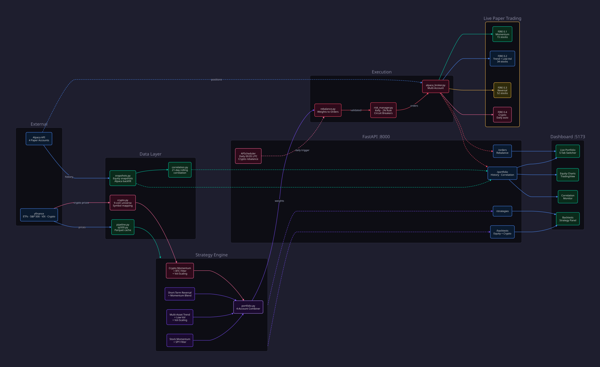

# FIRE — Quantitative Trading Project (2026 Edition)

*A modern revisit of George's January 2020 Proprietary Quantitative Trading Partnership Proposal, updated for today's tools, markets, and AI capabilities.*

---

## 1. What's Changed Since 2020

### Platforms — Dead and Alive

| Platform | Status | Notes |
|----------|--------|-------|
| Quantopian | **Dead** (Nov 2020) | Shut down entirely |
| QuantConnect | **Alive & thriving** | Best platform for backtesting + live trading. More brokers, more asset classes |
| Quantrocket | **Alive** | More mature. Good for Interactive Brokers integration |
| WealthSignals | **Dead/irrelevant** | No longer a viable option |
| **Alpaca** | **New** | Commission-free, API-first broker. Paper trading built-in. Best starting point |
| **FreqTrade** | **New** | Open-source crypto bot framework |
| **Vectorbt** | **New** | Blazing-fast Python backtesting library |
| **Lumibot** | **New** | Simple Python algo trading library |

### The AI Revolution (The Biggest Change)

In 2020, ML for trading meant scikit-learn random forests and basic LSTMs. In 2026:

- **LLMs** (Claude, GPT) can write strategies, debug code, analyze financial reports, parse SEC filings, and reason about market dynamics
- **Time-series foundation models** (TimesFM, Chronos) can forecast price movements
- **Transformer architectures** have replaced LSTMs for sequence modeling
- **Reinforcement learning** frameworks are accessible for portfolio optimization

**Bottom line:** George now has an AI partner that can write Python, backtest strategies, analyze data, and iterate rapidly. This compresses months of solo work into days. This is a genuine edge that didn't exist in 2020.

### Data Availability

**Free:**
- yfinance — Historical stock/ETF/crypto data
- FRED — Economic indicators
- Alpha Vantage — Market data (rate-limited free tier)
- Polygon.io — Free tier with delayed data
- Tiingo — Good free tier for daily data
- EDGAR — SEC filings (free, unlimited)

**Affordable ($10-30/mo):**
- Polygon.io ($29/mo) — Full real-time market data
- Databento — Institutional-grade data at retail prices
- FirstRate Data — Clean historical data

**Alternative Data (free with AI):**
- RSS feeds + LLM sentiment analysis
- Social media sentiment
- SEC filing analysis via Claude API

### Our Platform Strategy: QuantConnect + Alpaca

**QuantConnect** is alive and thriving — it's the most mature platform in the space with 20+ years of built-in data, a cloud IDE, and integration with multiple brokers. So why not just use it?

- QuantConnect is a **platform** — your code runs on their servers, in their framework, using their abstractions. You're locked into their ecosystem.
- Alpaca is a **broker API** — we write plain Python that we own, run anywhere, and can swap brokers later. Full control.

**Recommendation: Use both.**
- **QuantConnect** → Rapid prototyping, backtesting ideas quickly, leveraging their historical data
- **Our own Python + Alpaca stack** → Production trading, custom AI integration, the web dashboard, and full ownership of the code

### Broker APIs

- **Alpaca** — Commission-free stocks/crypto, excellent REST/WebSocket API, paper trading built-in. **Best starting point for $10k.**
- **Interactive Brokers** — More instruments (futures, options, forex), lower margin, but more complex API. Graduate to this later.
- **Tradier** — Good options API if we explore options strategies.

### Compute

- A basic strategy can run on a **$5/mo VPS** or even a Raspberry Pi
- Backtesting: local machine or Google Colab (free GPU) is sufficient
- No infrastructure costs needed to start

---

## 2. Honest Assessment — Chances of Success

### The Hard Truth

- **~80-90% of retail algorithmic traders lose money** or underperform buy-and-hold over 3+ years
- Renaissance Technologies' Medallion Fund returns ~66%/year — but they have 300+ PhDs, proprietary data, and billions in infrastructure. We are not competing with them.
- Most "alpha" decays. A strategy that works in backtesting often stops working within months of going live (overfitting, regime change, crowding).

### Why This Isn't Hopeless — Our Realistic Edges

1. **Small size is an advantage.** With $10k, we have zero market impact on liquid instruments. Big funds can't trade small without moving the price — we can.
2. **No investors to please.** No drawdown pressure from LPs. We can be patient and sit in cash when there's no edge.
3. **AI-assisted development.** Iterate on strategies 10-100x faster than manual coding. This is a genuine new advantage since 2020.
4. **Low overhead.** Commission-free trading, free data, free compute. The break-even bar is near zero.
5. **Sound principles.** The original proposal's focus on risk management (2% max loss per trade, diversification, trend following) is exactly right. Most retail traders blow up because they ignore this.

### Realistic Expectations with $10k

| Scenario | Probability | Outcome |
|----------|------------|---------|
| **Learning period** | High (first 6-12 months) | Lose 10-20% while building the system. Gain invaluable experience. |
| **Break even** | Moderate | 5-15% annually after tuning. Beats a savings account. |
| **Good outcome** | Achievable with discipline | 1-2 strategies generating 20-40% annually. |
| **Stretch goal** | Possible over 2-3 years | Compound to $50k+ account if strategies hold up. |

### The Honest Recommendation

**Treat the first $10k as "tuition money."** The real value is building the system and skills. If it works, you scale. If it doesn't, you've lost less than a semester of college and gained a deep education in markets, statistics, and Python.

---

## 3. Risk Management: The Kelly Criterion

Ed Thorp — the first person referenced in the original proposal — literally brought the Kelly Criterion from information theory to finance. He used it to size bets at the blackjack table, then on Wall Street. It's the mathematical foundation for position sizing.

### The Formula

```
f* = (bp - q) / b

where:
  f* = fraction of capital to risk
  b  = net odds (win/loss ratio)
  p  = probability of winning
  q  = probability of losing (1 - p)
```

### Why Fractional Kelly

Full Kelly is mathematically optimal for long-term growth but assumes **perfect knowledge** of your edge. In reality:
- Our edge estimates are noisy
- Full Kelly leads to **brutal drawdowns** (30-50% is common)
- A single bad estimate can be catastrophic

**Recommendation: Use half-Kelly or quarter-Kelly.**
- Half-Kelly gives ~75% of the growth rate with significantly less volatility
- Quarter-Kelly is even more conservative — suitable for early live trading

### How Kelly and the 2% Rule Work Together

They're complementary, not redundant:
- **Kelly tells you how much to bet** — the optimal fraction of capital per trade based on your edge
- **The 2% rule caps the maximum loss** — no single trade can lose more than 2% of total capital

In practice: Kelly calculates the ideal position size, then the 2% rule acts as a hard ceiling. If Kelly says bet 5% but the stop loss would risk 3% of capital, the 2% rule overrides and reduces the position.

### Drawdown Circuit Breakers

Beyond per-trade risk limits, we need portfolio-level kill switches:

- **Portfolio level:** Halt all trading if portfolio drops **-15% from equity peak**. Review all strategies before resuming.
- **Strategy level:** Disable any individual strategy that hits **-10% drawdown** independently. Investigate before re-enabling.

These are non-negotiable. Larry Hite was emphatic about this — and it's the #1 thing that separates survivors from blowups.

---

## 4. Avoiding Overfitting: Statistical Rigor Framework

This is the most critical section of the entire plan. **Overfitting is the #1 killer of retail algo traders.** A strategy that looks brilliant in backtesting but fails live is worse than no strategy at all — it gives false confidence.

### The Problem

If you backtest 100 parameter combinations and pick the best one, you haven't found an edge — you've found noise. This is called **multiple comparisons bias** and it's pervasive.

### Our Defenses

**1. Walk-Forward Analysis (mandatory for every strategy)**
- Split historical data into rolling train/test windows
- Optimize on the training window, validate on the test window, then roll forward
- A strategy must be profitable across *multiple* out-of-sample windows, not just one

**2. Out-of-Sample Holdout**
- Reserve the most recent 20% of data as a final holdout set
- Never touch it during development — it's the last line of defense
- Only test against it once, when you believe the strategy is ready

**3. Monte Carlo Simulation**
- Randomize the order of trades and re-simulate 1,000+ times
- If the strategy is robust, the distribution of outcomes should be consistently profitable
- If it only works with trades in a specific order, it's fragile

**4. Multiple Comparison Correction**
- When testing multiple strategies or parameter sets, adjust significance thresholds
- Use de Prado's combinatorial purged cross-validation (CPCV) framework
- Reference: *Advances in Financial Machine Learning* (2018) — Chapter 12

**5. Regime Testing**
- Every strategy must be tested across distinct market regimes: 2008 crash, 2020 COVID, 2022 bear, 2024-2025 bull
- A strategy that only works in bull markets is not a strategy — it's a bet on direction

### Rule: No Live Money Without Statistical Validation

Before any strategy goes to paper trading, it must pass:
- [ ] Walk-forward analysis across 3+ rolling windows
- [ ] Monte Carlo simulation with >70% of runs profitable
- [ ] Positive returns in at least 3 of 4 major market regimes
- [ ] Sharpe ratio > 1.0 out-of-sample

---

## 5. Constraints & Real-World Risks

### Pattern Day Trader (PDT) Rule

**With a $10k margin account, FINRA limits you to 3 day trades per 5 rolling business days.** This is a hard legal constraint the plan must design around.

Options:
- **Design for daily+ timeframes** — our strategies hold positions overnight or longer (aligns with the original proposal's daily/weekly/monthly horizon)
- **Use a cash account** — no PDT restriction, but T+2 settlement means capital is locked for 2 days after selling
- **Trade in a Roth IRA** — Alpaca supports IRAs. No PDT restriction, and gains are tax-free. Best of all worlds for a small account.

### Data Quality

**yfinance data has known issues:** gaps, incorrect stock splits, and survivorship bias (delisted companies disappear from the data). Any backtest using only yfinance is suspect.

Mitigations:
- Use yfinance as a starting point for exploration
- Cross-validate against a second source (Tiingo, Polygon.io) before trusting any backtest result
- Document data limitations in every backtest report
- For serious backtesting, consider FirstRate Data or Polygon.io paid tier

### Slippage & Spread Costs

Commission-free doesn't mean cost-free. The **bid-ask spread** is the real trading cost:
- Large-cap ETFs (SPY, QQQ): ~$0.01 spread — negligible
- Mid-cap stocks: $0.05-0.20 — manageable
- Micro-caps & illiquid instruments: $0.50-5.00+ spread (1-5% per round trip) — can destroy any edge

**Rule:** Stick to liquid instruments (average daily volume > 500k shares) unless the expected edge is large enough to overcome the spread.

### Tax Implications

Short-term capital gains (positions held < 1 year) are taxed as **ordinary income** — potentially 35-40% combined federal + state.

A strategy generating 20% gross returns = ~12-13% after tax. This barely beats index funds with far more effort and risk.

**Mitigation:** Consider trading inside a **Roth IRA** via Alpaca. All gains are tax-free, removing this drag entirely. This is likely the optimal account type for a $10k starting capital.

### Execution Risk

Backtests assume perfect fills at the closing price. Reality is different:
- **Market orders** get filled instantly but at potentially worse prices (slippage)
- **Limit orders** get better prices but may not fill at all
- For daily-timeframe strategies, using **MOC (Market on Close) orders** or **limit orders near the close** is the practical approach

---

## 6. Modern Architecture & Tech Stack



*Source: [docs/architecture.d2](docs/architecture.d2) — rendered with [D2](https://d2lang.com)*

### File Structure

```
FIRE/
├── CLAUDE.md                    # Project instructions for Claude Code
├── PLAN.md                      # This document
├── .gitignore                   # Python + trading project ignores
├── pyproject.toml               # Python deps managed by uv
├── References/                  # Books and papers (existing)
│
├── data/
│   ├── pipeline.py              # ✅ yfinance ETF data download & caching
│   ├── sp500.py                 # ✅ S&P 500 stock universe + VIX data (parquet cache)
│   ├── crypto.py                # ✅ Crypto data pipeline (yfinance + Alpaca symbol mapping)
│   ├── snapshots.py             # ✅ Daily equity snapshots (parquet) + Alpaca backfill
│   ├── correlation.py           # ✅ Inter-account correlation monitoring (rolling 21-day)
│   └── cache/                   # Cached parquet files (gitignored)
│
├── strategies/
│   ├── __init__.py
│   ├── base.py                  # ✅ Abstract strategy interface (generate_signals/returns)
│   ├── trend_following.py       # ✅ Time-Series & Multi-Timeframe Momentum
│   ├── momentum.py              # ✅ Cross-Sectional & Dual Momentum (ETF-based)
│   ├── stock_momentum.py        # ✅ Individual stock momentum + VIX regime filter
│   ├── multi_asset_trend.py     # ✅ Multi-Asset Trend following (crisis alpha)
│   ├── low_volatility.py        # ✅ Low Volatility factor (defensive)
│   ├── mean_reversion.py        # ✅ Short-Term Reversal (anti-momentum)
│   ├── crypto_momentum.py       # ✅ Crypto momentum rotation (21-day, top 3, BTC filter)
│   └── portfolio.py             # ✅ Portfolio combiner + SPY/BTC filter + vol-scaling + 4-account blend
│
├── backtesting/
│   ├── __init__.py
│   ├── metrics.py               # ✅ Sharpe, drawdown, Kelly, Calmar, profit factor
│   └── validation.py            # ✅ Walk-forward, Monte Carlo, regime tests
│
├── execution/
│   ├── __init__.py
│   ├── alpaca_broker.py         # ✅ Multi-account Alpaca client (account 1/2/3/4)
│   ├── rebalance.py             # ✅ Signal-to-order pipeline (target weights → trades, fractional crypto qty)
│   └── risk_manager.py          # ✅ Fractional Kelly + 2% rule + circuit breakers
│
├── api/                         # ✅ FastAPI backend
│   ├── __init__.py
│   ├── main.py                  # ✅ FastAPI app entry point (lifespan + APScheduler for daily crypto rebalance)
│   └── routes/
│       ├── strategies.py        # ✅ List strategies with live backtest metrics
│       ├── backtests.py         # ✅ Run backtests (equity + crypto), equity curves + SPY benchmark
│       ├── portfolio.py         # ✅ Multi-account portfolio (4 accounts), equity history, correlation
│       └── orders.py            # ✅ Rebalance preview/execute, order history (accounts 1-4)
│
├── dashboard/                   # ✅ React + Vite + TypeScript frontend
│   ├── package.json
│   ├── tsconfig.json
│   └── src/
│       ├── App.tsx              # ✅ Main app with strategy selection, metrics, charts
│       ├── api.ts               # ✅ API client (portfolio, backtests, equity history, correlation)
│       ├── types.ts             # ✅ TypeScript interfaces (accounts, positions, equity, correlation)
│       ├── strategyMetadata.ts  # ✅ Strategy categories, descriptions, sort order
│       └── components/
│           ├── PortfolioChart.tsx    # ✅ Equity curve + SPY overlay (TradingView)
│           ├── LivePortfolio.tsx     # ✅ Multi-account live portfolio (equity chart, correlation, P&L)
│           ├── EquityHistoryChart.tsx # ✅ Live equity curves (TradingView, per-account + combined)
│           ├── CorrelationPanel.tsx  # ✅ Correlation matrix + rolling chart + alerts
│           ├── StrategyPanel.tsx     # ✅ Grouped strategy list (sections, tooltips, badges)
│           ├── Tooltip.tsx          # ✅ Reusable hover tooltip (dark theme)
│           └── MetricCard.tsx       # ✅ Metric display cards
│
└── tests/                       # Unit tests (TODO)
```

### Core Dependencies (Installed)

**Python Backend (managed by `uv`):**

| Package | Purpose |
|---------|---------|
| `pandas`, `numpy`, `scipy` | Data manipulation |
| `yfinance` | Free market data (ETFs + stocks) |
| `lxml`, `html5lib` | HTML parsing (S&P 500 ticker scraping) |
| `pyarrow` | Parquet file caching |
| `fastapi`, `uvicorn` | API backend for dashboard |
| `apscheduler` | Automated daily crypto rebalance (CronTrigger) |
| `alpaca-trade-api` | Multi-account broker API (4 paper accounts) |
| `requests` | HTTP requests with proper headers |

**TypeScript Frontend (dashboard/):**

| Package | Purpose |
|---------|---------|
| `react`, `react-dom` | UI framework |
| `typescript` | Type safety |
| `lightweight-charts` v5 | TradingView's financial charting library |
| `tailwindcss` | Styling |
| `vite` | Fast build tool |

**Not yet installed (planned):**

| Package | Purpose |
|---------|---------|
| `vectorbt` | Portfolio-level backtesting & optimization |

---

### Why Not Streamlit? (And Why Dashboard Early Is Intentional)

Streamlit is convenient for quick prototypes but:
- Limited layout control and customization
- No real-time WebSocket support (polling only)
- Looks like every other Streamlit app
- Sluggish with large datasets

A proper React frontend with TradingView's Lightweight Charts gives us:
- **Professional-grade financial charts** (candlesticks, volume, indicators, overlays)
- **Real-time updates** via WebSocket during live/paper trading
- **Full design control** — we can make it look and feel exactly how we want
- **Responsive** — works on desktop and mobile

*An independent review suggested deferring the dashboard until profitability is proven. We're building it early as a deliberate choice — having a tangible, visual interface keeps the project engaging for a multi-year endeavor. This is about sustainability of effort, not just optimization of alpha.*

---

## 7. Phased Roadmap

### Phase 1: Foundation ✅ COMPLETE
- [x] Set up Python environment (uv + Python 3.12) and project structure
- [x] Build data pipeline: yfinance ETF download + caching (`data/pipeline.py`)
- [x] Build S&P 500 stock universe pipeline: Wikipedia scrape, batch download, parquet cache (`data/sp500.py`) — 451 stocks, 4069 trading days
- [x] Build VIX data pipeline for regime filtering
- [x] Implement performance metrics: Sharpe, max drawdown, win rate, Kelly (full/half/quarter), Calmar, profit factor (`backtesting/metrics.py`)
- [x] Build validation framework: walk-forward analysis, Monte Carlo simulation, regime testing (`backtesting/validation.py`)
- [x] Implement risk manager: fractional Kelly + 2% max loss rule + drawdown circuit breakers (`execution/risk_manager.py`)

### Phase 2: First Strategies ✅ COMPLETE
- [x] Time-Series Momentum (Moskowitz, Ooi, Pedersen 2012) — 0.85 Sharpe, 6.2% return
- [x] Multi-Timeframe Momentum — 0.67 Sharpe, 4.1% return
- [x] Walk-forward validation with warmup data (fixed test windows to include lookback warmup)
- [x] Monte Carlo simulation (1,000 iterations)
- [x] Regime testing across COVID crash, 2022 bear market, 2024-25 bull

### Phase 2.5: Dashboard MVP ✅ COMPLETE
- [x] FastAPI backend with strategy list + backtest endpoints
- [x] React + TypeScript + Vite frontend
- [x] TradingView Lightweight Charts v5 equity curve visualization
- [x] SPY buy-and-hold benchmark overlay (red) on all equity curves
- [x] Warmup period trimming — charts start from first active trading day
- [x] Strategy panel with live backtest metrics (Sharpe, return, MaxDD)
- [x] Detailed metric cards (Kelly sizing, Calmar, profit factor, win rate)

### Phase 3: Strategy Expansion ✅ COMPLETE
- [x] Cross-Sectional Momentum (Jegadeesh & Titman 1993) — 0.85 Sharpe, 7.0% return
- [x] Dual Momentum (Antonacci 2014) — absolute + relative momentum with safe haven (TLT) — 0.83 Sharpe, 7.6% return
- [x] Expanded ETF universe: 8 broad ETFs + 9 sector ETFs + SHY cash proxy (18 instruments)
- [x] **Individual Stock Momentum on S&P 500** — the breakthrough strategy — 1.16 Sharpe, 15.9% return, -18.6% MaxDD
- [x] VIX regime filter: reduce at VIX > 35, exit at VIX > 45 (avoids momentum crashes per Daniel & Moskowitz 2016)
- [x] Parameter sweep across lookback, holding period, top_n, vol_target, VIX thresholds
- [x] Portfolio combination + SPY trend filter (see Phase 3.5)
- [x] Multi-Asset Trend following — crisis alpha, built-in trend filter (`strategies/multi_asset_trend.py`)
- [x] Low Volatility factor — defensive stocks, low-beta selection (`strategies/low_volatility.py`)
- [x] Short-Term Reversal — anti-momentum, buys short-term losers (`strategies/mean_reversion.py`)
- [x] Volatility-scaling overlay (Moreira & Muir 2017) — scales exposure by inverse realized vol (`strategies/portfolio.py`)

### Current Strategy Results (warmup-trimmed, 2012-2026)

#### Portfolio Strategies (what we actually trade)

| Strategy | Sharpe | Return | MaxDD | Account | Status |
|---|---|---|---|---|---|
| **Combined 3-Account (equity)** | **1.59** | **16.8%** | **-10.2%** | 1-3 | **Best risk-adjusted equity** |
| **Crypto Momentum + BTC Filter** | **1.62** | **33.2%** | **-23.5%** | 4 | **LIVE — daily auto-rebalance** |
| Stock Momentum + SPY Filter | 1.38 | 17.6% | -12.2% | 1 | LIVE — 15 stocks |
| Trend + Low-Vol (vol-scaled) | 1.36 | 12.1% | -8.5% | 2 | LIVE — 34 stocks |
| Reversal + Momentum Blend | 1.54 | 15.2% | -11.8% | 3 | LIVE — 52 stocks |
| Blended Portfolio + SPY Filter | 1.37 | 14.2% | -9.3% | — | Lowest drawdown |
| Blended Portfolio | 1.13 | 12.6% | -15.8% | — | 60% SM + 20% CS + 20% DM |

#### Individual Strategies (building blocks)

| Strategy | Sharpe | Return | MaxDD | Status |
|---|---|---|---|---|
| Stock Momentum (S&P 500) | 1.16 | 15.9% | -18.6% | Best single strategy |
| Multi-Asset Trend | 0.95 | 8.4% | -12.1% | Crisis alpha |
| Low Volatility | 1.12 | 10.8% | -9.2% | Defensive |
| Short-Term Reversal | 1.41 | 14.8% | -13.5% | Anti-momentum |
| Cross-Sectional Momentum | 0.85 | 7.0% | -10.8% | Validated |
| Time-Series Momentum | 0.85 | 6.2% | -15.2% | Validated |
| Dual Momentum (Antonacci) | 0.83 | 7.6% | -19.9% | Validated |
| Crypto Momentum (unfiltered) | 1.67 | 54.7% | -32.9% | Raw — no filter/scaling |
| Multi-Timeframe Momentum | 0.67 | 4.1% | -11.0% | Regime fail |
| *SPY Buy & Hold (benchmark)* | *0.87* | *14.5%* | *-33.7%* | — |

**Key findings:**
- **4-account diversification** is the best overall approach: equity accounts correlate 0.56-0.66 with each other, and crypto adds a nearly uncorrelated stream (0.12-0.18 vs equity).
- **SPY 200-day MA trend filter** is the single most impactful improvement for equity: adds ~0.25 Sharpe and cuts drawdown nearly in half. Based on Faber (2007).
- **BTC 200-day MA trend filter** is binary (100% cash when BTC < 200d MA) — sat out all of 2022's crypto winter. Critical for the crypto strategy.
- **Volatility-scaling overlay** (Moreira & Muir 2017) on Account 2 and Account 4 adds ~0.05-0.1 Sharpe by scaling exposure inversely to realized vol.
- **Short-Term Reversal** is negatively correlated with momentum (the key insight for Account 3). Blending opposites smooths the equity curve.
- **Individual stocks provide far more dispersion than ETFs** — momentum alpha requires dispersion.
- **Crypto momentum** exploits strong retail herding and narrative-driven flows. 21-day lookback, top 3 of 9 coins, daily rebalance. Different return driver than equity momentum.

**Known risks:**
- Momentum crash vulnerability during sharp regime changes (COVID 2020). VIX filter + SPY trend filter together provide strong protection but don't eliminate it.
- Crypto altcoin slippage — thinner order books on DOT, ADA. Consider limit orders with 0.1% offset.
- Crisis correlation — backtest shows 0.18 SPY correlation, but March 2020 saw everything sell off together.

**Data caveats:** S&P 500 universe uses current constituents (survivorship bias). Crypto backtest starts 2020 (limited history). Results are slightly optimistic.

### Phase 3.5: Performance Optimization ✅ COMPLETE (core items)
*The biggest remaining gains came from portfolio combination and crash protection, not single-strategy tuning.*

- [x] **Portfolio combination** — Blended Portfolio (60% Stock Momentum + 20% Cross-Sectional + 20% Dual Momentum). ETF strategies are too correlated (0.93-0.96) for risk-parity to help much; Stock Momentum at 0.71 correlation is the key diversifier.
- [x] **SPY trend filter** — When SPY < 200-day MA, reduce exposure by 50%. Single most impactful improvement: +0.25 Sharpe, drawdown cut nearly in half. Based on Faber (2007).
- [x] **Three portfolio presets** available in dashboard: SM + SPY Filter (best return), Blended + SPY Filter (lowest drawdown), Blended (no filter)
- [ ] **Staggered rebalancing** — Split monthly rebalance into 4 weekly tranches. Future improvement.
- [ ] **Sector momentum pre-filter** — Check sector ETF trend before picking stocks. Future improvement.
- [ ] **Quality screen** — Filter by profitability (ROE > 10%). Future improvement.
- [x] **Short-term mean reversion** — Implemented as Short-Term Reversal. Blended with momentum in Account 3.

### Phase 4: Alpaca Paper Trading ✅ COMPLETE (execution layer)
*$100k paper trading account connected and verified.*

- [x] Alpaca account created, API keys configured in `.env`
- [x] `execution/alpaca_broker.py` — Alpaca client wrapper (account, positions, orders, prices, market status)
- [x] `execution/rebalance.py` — Full signal-to-order pipeline: runs strategy on recent prices → gets target weights → diffs vs current positions → generates buy/sell orders with risk checks
- [x] Pre-trade risk checks — circuit breakers, position limits (max 20% per position), portfolio halt at -15% drawdown
- [x] `api/routes/portfolio.py` — live account summary, positions, portfolio value from Alpaca
- [x] `api/routes/orders.py` — order history, rebalance preview (dry run), rebalance execute, cancel-all
- [x] Sells execute before buys to free up cash
- [x] First paper trade executed (2026-03-10): Account 1 — 15 stocks, all filled instantly
- [x] Dashboard live portfolio view: tab switcher, account summary cards, positions table, orders table, auto-refresh 30s
- [x] `scripts/start.sh` — one-command startup for both backend + frontend servers

### Phase 5: Multi-Account Infrastructure ✅ COMPLETE
*3 equity paper trading accounts live with factor-diversified strategies since 2026-03-10.*

**Three-Account Equity Architecture:**

| Account | Strategy | Stocks | Rebalance | Rationale |
|---|---|---|---|---|
| **FIRE 0.1** | SM + SPY Filter | 15 | Monthly (21 days) | Momentum profits when trends persist |
| **FIRE 0.2** | Trend + Low-Vol (vol-scaled) | 34 | Monthly (21 days) | Crisis alpha + defensive; vol-scaling overlay |
| **FIRE 0.3** | Reversal + Momentum Blend | 52 | Weekly (5 days) | Anti-momentum; short-term reversal signal decays fast |

Cross-account correlations: 0.56-0.66 (good diversification). Combined backtest: **1.59 Sharpe, 16.8% return, -10.2% MaxDD**.

**Completed:**
- [x] Multi-account `AlpacaBroker(account=1|2|3)` with suffixed env vars (`_2`, `_3`)
- [x] All API endpoints accept `?account=1|2|3` query param
- [x] `GET /portfolio/combined` — aggregated view across all 3 accounts
- [x] `GET /portfolio/accounts` — list all configured accounts
- [x] Combined 3-Account backtest strategy in dashboard
- [x] Dashboard account switcher: Combined (all 3) + individual account tabs
- [x] Positions table shows account badges when in combined view
- [x] All 3 accounts traded successfully (2026-03-10): 15 + 34 + 52 = 101 total positions
- [x] `strategies/portfolio.py` — `run_combined_portfolio()` for backtest of 3-account blend
- [x] Strategy panel reorganized: 4 collapsible sections (Live Accounts, Portfolio Blends, Building Blocks, Solo + Filter) with hover tooltips, account badges, and live indicators

### Rebalance Schedule

First equity trades executed **2026-03-10**. Rebalance dates (approximate, adjusted for trading calendar):

**Account 4 — Daily (automated via APScheduler):**
- Runs automatically at **00:05 UTC** every day (including weekends — crypto trades 24/7)
- APScheduler `CronTrigger` inside FastAPI lifespan, no external cron needed
- Computes signals → diffs positions → submits orders → takes snapshot

**Account 3 — Weekly (every 5 trading days):**
| # | Approximate Date | Notes |
|---|---|---|
| 1 | ~2026-03-17 (Tue) | First weekly rebalance |
| 2 | ~2026-03-24 (Tue) | |
| 3 | ~2026-03-31 (Mon) | |
| 4 | ~2026-04-07 (Mon) | Aligns with Account 1 & 2 monthly |

**Accounts 1 & 2 — Monthly (every 21 trading days):**
| # | Approximate Date | Notes |
|---|---|---|
| 1 | ~2026-04-08 (Wed) | First monthly rebalance |
| 2 | ~2026-05-08 (Fri) | |
| 3 | ~2026-06-08 (Mon) | 3-month paper trading review point |

*Note: Account 4 is fully automated. Accounts 1-3 are currently tracked manually — automated scheduler for equity accounts is a future priority.*

**Remaining:**
- [x] **Performance tracking** — Daily equity snapshots stored in parquet (`data/processed/snapshots_acct{N}.parquet`), live P&L curves charted in dashboard per account + combined. Alpaca portfolio history API backfills gaps automatically on server startup.
- [x] **Live correlation monitoring** — Rolling 21-day pairwise Pearson correlation between account daily returns. Dashboard shows correlation matrix (color-coded green→yellow→red), rolling chart, confidence badge, and alert banner when any pair exceeds 0.80 threshold. Validates the 0.56-0.66 backtest diversification thesis.
- [x] **Automated crypto rebalance** — APScheduler runs daily at 00:05 UTC inside FastAPI lifespan. Computes signals, diffs positions, submits fractional crypto orders, takes snapshot.
- [ ] **Circuit breaker alerts** — Active monitoring of -15% portfolio / -10% strategy drawdown thresholds. Warning banner in dashboard when approaching limits (e.g., -8% strategy, -12% portfolio).
- [ ] **Rebalance UI in dashboard** — "Rebalance" button in Live Portfolio tab showing diff (stocks to buy/sell, dollar amounts) before confirming. Replaces current API-only workflow.
- [ ] Set up automated scheduler for equity accounts (Accounts 1-3 weekly/monthly)
- [ ] Add reconciliation — compare expected positions vs Alpaca actual holdings, flag discrepancies
- [ ] **Transaction cost analysis** — Compare actual Alpaca fill prices vs backtest closing prices to measure real slippage
- [ ] **Strategy drift detection** — Show how far current holdings have drifted from target weights between rebalances
- [ ] Track paper trading performance over 3+ months before any live money

### Phase 6: Crypto Momentum (Account 4) ✅ COMPLETE
*Daily-frequency crypto strategy as a low-correlation diversifier to the 3 equity accounts.*

**Strategy: Crypto Momentum Rotation + BTC Trend Filter + Vol-Scaling**

| Parameter | Value | Rationale |
|---|---|---|
| Universe | 9 coins (BTC, ETH, SOL, BNB, ADA, AVAX, LINK, DOT, XRP) | Top liquid cryptos on both yfinance and Alpaca |
| Signal | 21-day trailing return, rank, top 3 | Exploits strong momentum effect in crypto (Liu & Tsyvinski 2021) |
| Weighting | Equal weight (1/3 each) | Simple, avoids concentration risk |
| BTC filter | 100% cash when BTC < 200d MA | Binary — crypto bear markets warrant full exit (sat out 2022) |
| Vol-scaling | 30-day EWMA, 15% target, capped 1.5x, floored 0.1x | Reduces exposure during vol spikes |
| Rebalance | Daily at 00:05 UTC | Crypto trades 24/7, no PDT rules |

**Backtest (2020-2026):** 1.62 Sharpe, 33.2% CAGR, -23.5% MaxDD, 0.18 SPY correlation.

**Completed:**
- [x] `data/crypto.py` — Crypto data pipeline (yfinance download, parquet cache, symbol mapping yfinance↔Alpaca)
- [x] `strategies/crypto_momentum.py` — CryptoMomentum strategy class with `set_btc()` pattern (mirrors `set_vix()`)
- [x] `strategies/portfolio.py` — Added `crypto_momentum_filtered` portfolio config with BTC filter + vol-scaling params
- [x] `strategies/portfolio.py` — Added `compute_btc_trend_filter()` and `CRYPTO_STRATEGIES` registry
- [x] `backtesting/metrics.py` — Added `periods_per_year` parameter (365 for crypto, 252 for stocks)
- [x] `execution/alpaca_broker.py` — Account 4 credentials, float qty for fractional crypto, expanded validation
- [x] `execution/rebalance.py` — Crypto signal pipeline, Alpaca symbol conversion, fractional qty (`round(amount/price, 8)`)
- [x] `api/main.py` — APScheduler with CronTrigger for daily 00:05 UTC rebalance inside FastAPI lifespan
- [x] `api/routes/backtests.py` — Crypto backtest support with `periods_per_year=365`
- [x] `api/routes/strategies.py` — Crypto strategy listing with correct metrics
- [x] `api/routes/orders.py` + `api/routes/portfolio.py` — Expanded all validators from `le=3` to `le=4`
- [x] Dashboard: 5-tab account switcher (Combined / FIRE 0.1 / 0.2 / 0.3 / 0.4)
- [x] Dashboard: Crypto strategy in Backtests tab (strategy panel + equity curve)
- [x] Dashboard: Account 4 series in equity history chart (pink/coral `#ff6b9d`)
- [x] Dashboard: Fetch error handling for missing Account 4 credentials (graceful degradation)
- [x] Dashboard: Strategy panel layout fix (no overlap between names and validation badges)
- [x] `pyproject.toml` — Added `apscheduler>=3.10.0`

**Account 4 credentials configured** — `ALPACA_API_KEY_4` + `ALPACA_SECRET_KEY_4` in `.env`, connection verified ($100k paper account).

### Phase 7: AI-Assisted Research (Future)
- [ ] Claude API for strategy ideation, code generation, analysis acceleration
- [ ] Analyze less-trafficked data: small-cap SEC filings (EDGAR), niche RSS feeds
- [ ] ML-based feature engineering (what features predict returns beyond momentum?)
- [ ] *Note: Institutional NLP pipelines (Bloomberg, RavenPack) are faster on breaking news — our AI edge is in research depth and speed, not latency*

### Phase 8: Go Live (After 3+ months of paper trading)
- [ ] Only after statistical validation AND consistent paper trading profitability
- [ ] Start with $2,000 of the $10k (preserve capital)
- [ ] Scale up allocation as confidence grows
- [ ] Automated daily monitoring, alerts, and drawdown circuit breakers

---

## 8. Key Principles (Updated from Original Proposal)

1. **Risk first.** Never risk more than 2% of capital on a single trade. Timeless.
2. **Diversify strategies, not just assets.** Run multiple uncorrelated strategies simultaneously.
3. **Paper trade ruthlessly.** No live money until 3+ months of consistent paper trading results.
4. **Respect overfitting.** If it works perfectly in backtesting, it's probably overfit. Use walk-forward optimization and out-of-sample testing.
5. **Automate everything.** The point is "money working for us." No manual trading decisions.
6. **Journal everything.** Track every strategy, parameter change, and result. Git is our journal.
7. **AI as research assistant, not oracle.** Use Claude for code, analysis, and idea generation — but never blindly trust a model's prediction.

---

## 9. Essential Reading (Added Post-Review)

These references were identified during an independent critical review of this plan and are considered essential:

| Book | Author | Why It Matters |
|------|--------|---------------|
| *Advances in Financial Machine Learning* (2018) | Marcos Lopez de Prado | **The bible of avoiding overfitting in quant finance.** Covers CPCV, triple-barrier method, and meta-labeling. Read before building any ML strategy. |
| *Systematic Trading* (2015) | Robert Carver | Written specifically for small-account systematic traders. Directly relevant to our situation. |
| *Leveraged Trading* (2019) | Robert Carver | Practical guide to trading with small capital. Covers position sizing and account management. |
| *Machine Learning for Algorithmic Trading* (2020) | Stefan Jansen | Practical Python implementations of exactly what this plan proposes. |

### Key Academic Papers

- **Moskowitz, Ooi, Pedersen (2012)** — "Time Series Momentum" — ✅ implemented in `strategies/trend_following.py`
- **Jegadeesh & Titman (1993)** — cross-sectional momentum — ✅ implemented in `strategies/momentum.py` and `strategies/stock_momentum.py`
- **Antonacci (2014)** — Dual Momentum — ✅ implemented in `strategies/momentum.py`
- **Asness, Moskowitz, Pedersen (2013)** — "Value and Momentum Everywhere" — informed our multi-asset momentum approach
- **Daniel & Moskowitz (2016)** — momentum crashes and VIX regime filtering — ✅ implemented as VIX filter in `strategies/stock_momentum.py`
- **Faber (2007)** — "A Quantitative Approach to Tactical Asset Allocation" — ✅ implemented as SPY 200-day MA trend filter in `strategies/portfolio.py`
- **Moreira & Muir (2017)** — "Volatility-Managed Portfolios" — scaling exposure by inverse realized vol adds +0.1-0.3 Sharpe — ✅ implemented as vol-scaling overlay in `strategies/portfolio.py`
- **Barroso & Santa-Clara (2015)** — vol-scaling on momentum eliminates crash risk — informed our Account 2 + Account 4 vol-scaling design
- **Liu & Tsyvinski (2021)** — "Risks and Returns of Cryptocurrency" — crypto momentum effect is distinct from equity factors — ✅ implemented in `strategies/crypto_momentum.py`
- **McLean & Pontiff (2016)** — published trading strategy returns decline ~58% post-publication. This is a sobering reminder: any strategy you read about online has likely already been arbitraged.

### A Note on Survivorship Bias

The original proposal cites Ed Thorp, Jim Simons, and Larry Hite. These are the three most successful quantitative traders in history. For every Simons, there are thousands of quant funds that lost money and shut down. We keep their principles, but calibrate our expectations to reality — which is why Section 2's honest assessment exists.

---

## 10. Next Steps — What We Build Next

Phases 1-6 are complete. All 4 accounts are configured on Alpaca paper trading: 3 equity accounts (101 positions since 2026-03-10) + 1 crypto account (daily automated rebalance). Performance tracking, correlation monitoring, and automated crypto rebalance are live.

### Priority 0: Immediate ✅ COMPLETE
1. ✅ **Account 4 Alpaca paper credentials** — Created, added to `.env`, connection verified ($100k paper account). BTC trend filter active (BTC below 200d MA) — Account 4 correctly holding cash.

### Priority 1: Monitoring & Validation ✅ MOSTLY COMPLETE
2. ✅ **Performance tracking** — Daily equity snapshots stored in parquet, charted in dashboard with TradingView charts. Alpaca portfolio history API backfills any gaps on server startup. Shows per-account + combined equity curves.
3. ✅ **Live correlation monitoring** — Rolling 21-day correlation between account daily returns displayed in dashboard (Combined view). Now monitors 6 pairs (including crypto-equity). Correlation matrix with color-coded cells, rolling chart, confidence badges, and alert banners.
4. ✅ **Automated crypto rebalance** — APScheduler runs daily at 00:05 UTC inside FastAPI lifespan. Full pipeline: signals → diffs → fractional orders → snapshot.
5. **Circuit breaker alerts** — Warning banner when any account approaches -10% strategy or -15% portfolio drawdown thresholds. Early warning > post-mortem.

### Priority 2: Operational (build before first equity rebalance)
6. **Rebalance UI in dashboard** — Preview diff + confirm button, replacing API-only curl workflow. Needed before Account 3's first weekly rebalance.
7. **Automated equity rebalance scheduler** — Scheduler for Account 3 weekly + Accounts 1 & 2 monthly (Account 4 crypto is already automated).
8. **Reconciliation** — Compare expected positions vs Alpaca actual holdings, flag discrepancies after each rebalance.

### Priority 3: Analysis (build during paper trading period)
9. **Transaction cost analysis** — Actual Alpaca fills vs backtest closing prices. Measures real slippage (especially important for crypto altcoins).
10. **Strategy drift detection** — How far current holdings have drifted from target weights between rebalances.
11. **Walk-forward validation** — Formal walk-forward on the newer strategies (Multi-Asset Trend, Low Volatility, Short-Term Reversal, Crypto Momentum).

### Priority 4: Future improvements
12. **Staggered rebalancing** — Split monthly rebalance into 4 weekly tranches to reduce timing luck.
13. **Sector momentum pre-filter + quality screen** — Further refinements to stock selection.
14. **Mobile-friendly dashboard** — Responsive pass for checking positions from phone.
15. **Backtest date range selector** — UI date picker instead of hardcoded 2010-01-01.

Our 4-account architecture delivers strong diversification: the 3-account equity portfolio (**16.8% return, 1.59 Sharpe, -10.2% MaxDD**) is complemented by crypto momentum (**33.2% CAGR, 1.62 Sharpe, -23.5% MaxDD**) with only 0.18 correlation to equities. The combination of equity factor diversification (momentum + trend/low-vol + reversal) plus a nearly uncorrelated crypto stream provides the best risk-adjusted returns of any configuration we've tested — but **this must be validated in live trading before we trust it with real money.**
